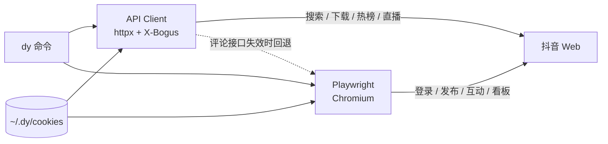

<p align="center">
  <h1 align="center">🎬 dy-cli</h1>
  <p align="center">抖音命令行工具 — 搜索、下载、发布、互动、热榜、直播、数据分析，对 AI Agent 友好。</p>
</p>

<p align="center">
  <a href="https://pypi.org/project/dy-cli/"></a>
  <a href="https://github.com/Youhai020616/douyin/actions"></a>
  <a href="https://pypi.org/project/dy-cli/"></a>
  <a href="./LICENSE"></a>
</p>

<p align="center">
  <a href="#安装">安装</a> •
  <a href="#快速开始">快速开始</a> •
  <a href="#命令">命令</a> •
  <a href="#配置">配置</a> •
  <a href="#面向-ai-agent-的结构化输出">Agent 输出</a> •
  <a href="./LICENSE">许可证</a>
</p>

---

<p align="center">
  
</p>

## 安装

```bash
pip install dy-cli
playwright install chromium   # 登录 / 发布 / 互动需要浏览器
dy init                       # 引导：环境检查 → 配置代理 → 扫码登录（一次即可）
```

源码安装：

```bash
git clone https://github.com/Youhai020616/douyin.git
cd douyin && bash setup.sh   # 创建 .venv、安装依赖与 Chromium、注册 dy 命令
```

> **依赖说明**
> - Python ≥ 3.10
> - Playwright Chromium — 登录、发布、互动等浏览器操作需要；`dy init` / `setup.sh` 也会自动安装
> - `ffmpeg` — 可选，仅 `dy live record` 录制直播需要（macOS: `brew install ffmpeg`）

## 快速开始

```bash
dy init                                 # 初始化 + 扫码登录（一次即可）
dy search "美食"                         # 搜索 → 结果自动缓存
dy read 1                               # 查看第 1 条结果（短索引）
dy dl 1                                 # 下载第 1 条（无水印）
dy like 1                               # 点赞第 1 条
dy trending                             # 热榜 Top 50
dy live list                            # 推荐直播间列表
dy publish -t "标题" -c "描述" -v video.mp4   # 发布视频
```

## 功能特性

- 🔍 **搜索** — 关键词搜索，支持排序 / 时间 / 类型筛选，支持用户搜索
- 📥 **下载** — 无水印视频与图文，带进度条，支持画质选择与按用户批量下载
- 📝 **发布** — 视频与图文发布，支持标签、封面、定时、可见范围
- 🔥 **热榜** — 实时热搜 Top 50，支持自动刷新监看
- 📺 **直播** — 直播间列表、直播信息、拉流地址、ffmpeg 录制
- 💬 **互动** — 点赞、收藏、评论、关注（Playwright）
- 📊 **数据看板** — 通过 XHR 拦截获取创作者数据
- 👤 **主页** — 用户信息、作品列表
- 🔢 **短索引** — `dy search → dy read 1 → dy like 1 → dy dl 1`，无需复制 ID
- 📦 **导出** — `dy search "AI" -o results.csv`（JSON / CSV / YAML）
- 🔐 **登录** — 扫码登录 + 浏览器 Cookie 自动提取
- 👥 **多账号** — Cookie 按账号隔离存储
- 🤖 **Agent 友好** — `--json-output` 输出统一 JSON 信封，成功与失败都可机器解析；stdout 只有数据，进度提示走 stderr
- 🛡️ **反检测** — 高斯抖动延迟、指数退避、验证码冷却

## 命令

### 搜索与查看

```bash
dy search "关键词"                        # 搜索视频
dy search "咖啡" --sort 最多点赞          # 按点赞排序
dy search "风景" --type atlas             # 搜索图文
dy search "日食记" --type user            # 搜索用户
dy search "AI" -o results.csv            # 导出为 CSV
dy read 1                                # 查看第 1 条结果（短索引）
dy detail AWEME_ID                       # 按 ID 查看详情
dy comments 1                            # 查看评论（Playwright）
```

### 下载

```bash
dy dl 1                                  # 按短索引下载
dy download https://v.douyin.com/xxx     # 按分享链接下载
dy download 1234567890 --music           # 同时下载背景音乐
dy dl 1 --list-quality                   # 列出可用画质
dy dl 1 -q 720                           # 指定画质 (best/worst/2160/1440/1080/720/540)
dy dl SEC_USER_ID --user --limit 20      # 批量下载该用户作品
dy dl SEC_USER_ID --user -q 1080         # 批量下载并指定画质
```

### 热榜与直播

```bash
dy trending                              # 热榜 Top 50
dy trending --count 10 -o hot.json       # 导出前 10 条
dy trending --watch                      # 每 5 分钟自动刷新
dy live list                             # 推荐直播间
dy live list --count 10                  # 显示 10 个直播间
dy live info ROOM_ID                     # 直播间信息
dy live record ROOM_ID                   # 使用 ffmpeg 录制
```

### 发布

```bash
dy publish -t "标题" -c "描述" -v video.mp4                         # 发布视频
dy publish -t "标题" -c "描述" -i img1.jpg -i img2.jpg              # 发布图文
dy publish -t "标题" -v v.mp4 --tags AI --visibility 仅自己可见      # 私密 + 标签
dy publish -t "标题" -v v.mp4 --thumbnail cover.jpg                  # 自定义封面
dy publish -t "标题" -v v.mp4 --schedule "2026-03-20T08:00:00+08:00" # 定时发布
dy pub -t "标题" -v v.mp4 --dry-run                                  # 仅预览，不发布
```

### 互动

```bash
dy like 1                                # 点赞（短索引）
dy like 1 --unlike                       # 取消点赞
dy fav 1                                 # 收藏
dy comment 1 -c "好看!"                  # 评论
dy follow SEC_USER_ID                    # 关注用户
```

### 主页与数据

```bash
dy me                                    # 我的登录信息
dy profile SEC_USER_ID --posts           # 用户主页 + 作品列表
dy analytics                             # 创作者数据看板
dy notifications                         # 通知消息
```

### 账号与配置

```bash
dy login                                 # 扫码登录
dy login --browser                       # 从浏览器提取 Cookie
dy status                                # 登录状态
dy account list                          # 列出账号
dy account add NAME                      # 添加账号并登录
dy config show                           # 查看配置
dy config set api.proxy http://...       # 设置代理
```

### 别名

| 简写 | 命令 | | 简写 | 命令 |
|------|------|---|------|------|
| `dy s` | `search` | | `dy r` / `dy read` | `detail` |
| `dy dl` | `download` | | `dy t` | `trending` |
| `dy pub` | `publish` | | `dy fav` | `favorite` |
| `dy cfg` | `config` | | `dy acc` | `account` |

## 面向 AI Agent 的结构化输出

几乎所有命令支持 `--json-output`：stdout 只输出一个 JSON 信封，进度提示全部走 stderr，可直接管道给 `jq` 或由 Agent 解析：

```bash
dy trending --count 3 --json-output | jq '.data[].word'
dy status --json-output | jq '.data.authenticated'
dy like 1 --json-output            # 变更类命令也返回结构化结果
```

```json
{ "ok": true,  "schema_version": "1", "data": ... }
{ "ok": false, "schema_version": "1", "error": { "code": "not_authenticated", "message": "..." } }
```

失败时退出码为 1，`error.code` 取值固定（`not_authenticated` / `invalid_argument` / `api_error` / `playwright_error` 等）。完整约定见 [SCHEMA.md](./SCHEMA.md)，在 Claude Code / Cursor 中作为 Skill 使用见 [docs/claude-code-integration.md](./docs/claude-code-integration.md)。

## 配置

| 路径 | 用途 |
|------|------|
| `~/.dy/config.json` | 全局配置 |
| `~/.dy/cookies/<账号名>.json` | 各账号 Cookie（多账号隔离） |
| `~/Downloads/douyin` | 默认下载目录 |

默认配置（`dy config show`）：

```json
{
  "api":        { "cookie_file": "~/.dy/cookies/default.json", "proxy": "", "timeout": 30 },
  "playwright": { "headless": false, "chromium_path": "", "slow_mo": 0 },
  "default":    { "account": "default", "engine": "auto", "output": "table", "download_dir": "~/Downloads/douyin" }
}
```

用 `dy config set <key> <value>` 修改（布尔值 / 数字会自动转换类型）：

```bash
dy config set api.proxy http://127.0.0.1:7897      # 代理
dy config set api.timeout 60                       # 请求超时（秒）
dy config set playwright.headless true             # 无头模式，不弹出浏览器
dy config set default.engine api                   # 引擎：auto | api | playwright
dy config set default.download_dir ~/Videos/douyin # 下载目录
dy config get api.proxy                            # 读取单项
dy config reset                                    # 恢复默认
```

## 架构

| 引擎 | 负责 | 技术 |
|------|------|------|
| **API Client** | 搜索、下载、热榜、直播、主页 | httpx + 逆向 Web API（X-Bogus 签名） |
| **Playwright** | 发布、登录、数据看板、点赞、评论 | Chromium 浏览器自动化 |



## 平台支持

macOS ✅ &nbsp; Linux ✅ &nbsp; Windows ✅

## 开发

```bash
git clone https://github.com/Youhai020616/douyin.git && cd douyin
python3 -m venv .venv && source .venv/bin/activate
pip install -e . && pip install pytest ruff
ruff check src/ tests/      # 代码检查
pytest tests/ -v            # 单元测试
```

CI 在 Python 3.10 / 3.12 上运行 lint 与测试。

## 文档

- [使用指南](./docs/cli-guide.md) — 安装、初始化、各命令详解
- [Claude Code 集成](./docs/claude-code-integration.md) — 作为 AI Agent Skill 使用
- [结构化输出约定](./SCHEMA.md)

## 免责声明

本项目基于抖音网页端逆向接口与浏览器自动化实现，目前处于 **Alpha** 阶段，仅供学习与研究使用。接口可能随平台更新而失效；自动化操作存在账号风控风险。请遵守抖音用户协议，使用后果自行承担。

## 许可证

[MIT](./LICENSE)
